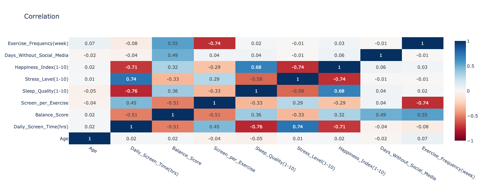
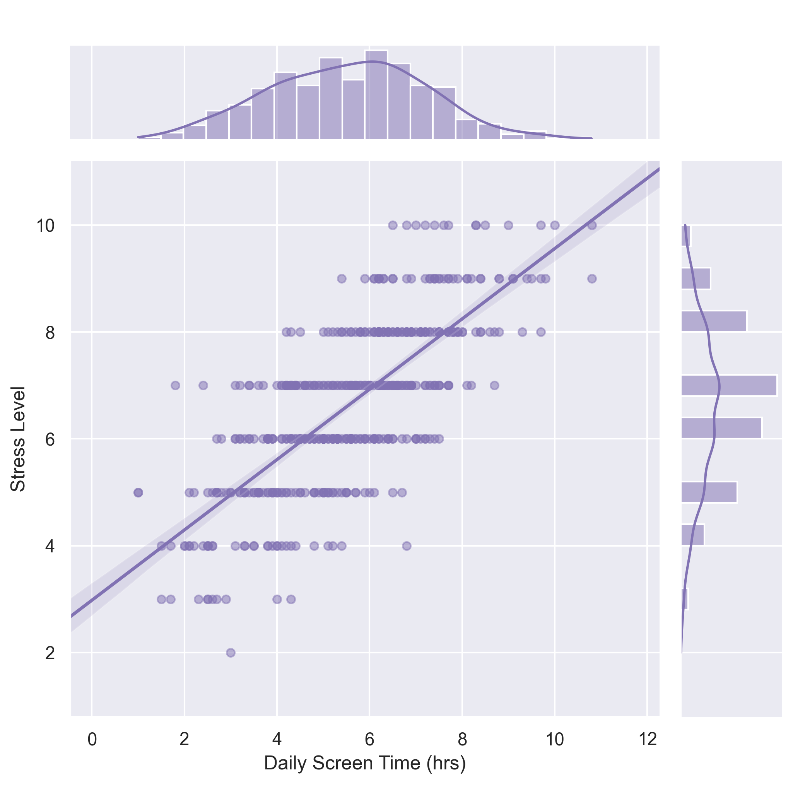
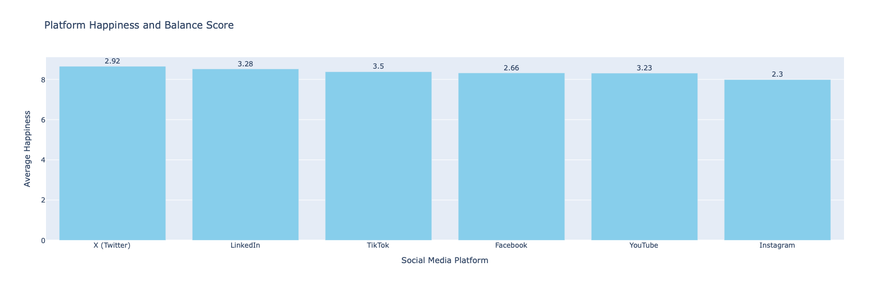
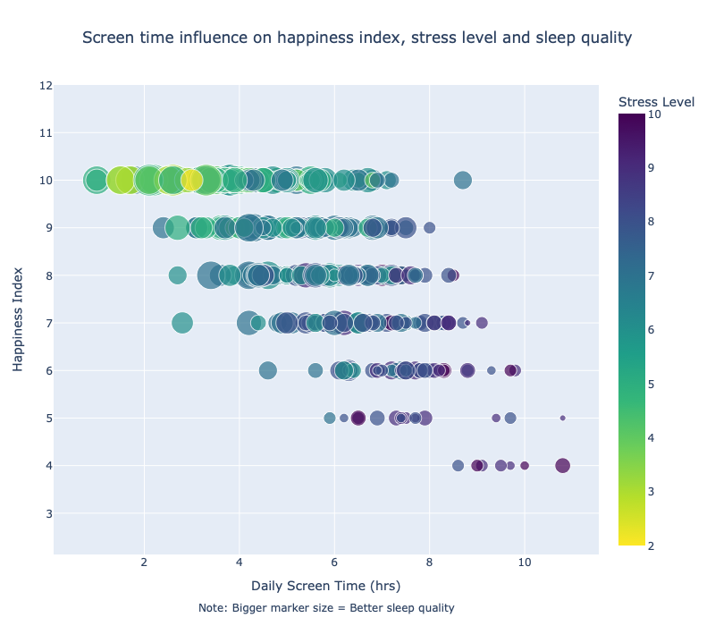
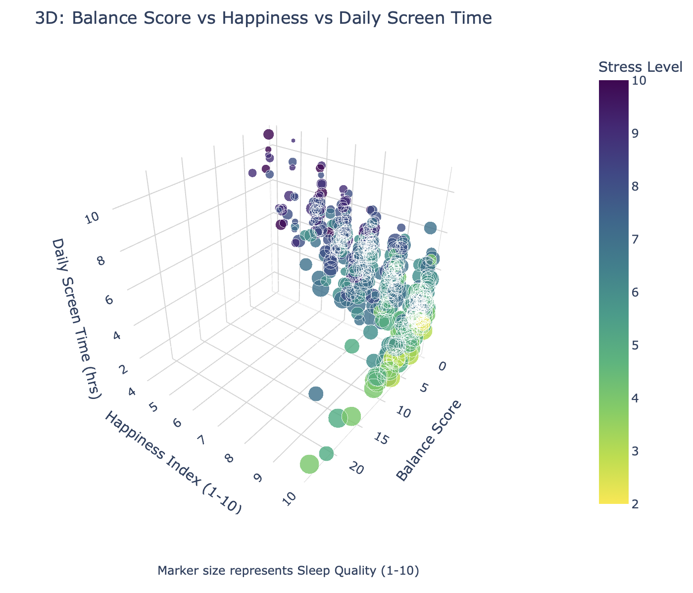
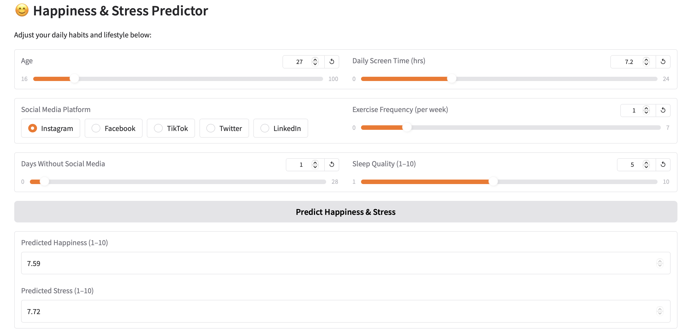
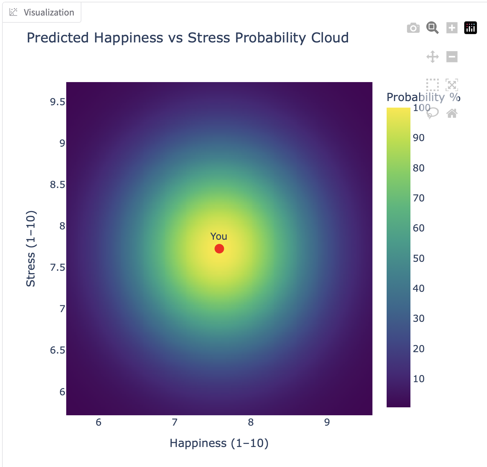

# Mental Health and Social Media Balance Analysis


[](https://opensource.org/licenses/MIT)
[](https://www.python.org/downloads/release/python-3130/)

This repository contains a **data analysis project** exploring how **social media usage**, **screen time**, and **lifestyle habits** affect **mental health indicators** such as happiness, stress, and sleep quality.

The project uses a **dataset of 500 users** and a **Jupyter Notebook** to perform descriptive statistics, EDA, ML modeling, and visualization.

---

## Project Overview
Social media has become an integral part of modern life, but its impact on well‑being is widely debated. This project analyzes user demographics, platform preferences, and daily habits to uncover patterns affecting mental health.

### Tools used
- **Pandas**, **NumPy** – data preparation
- **Matplotlib**, **Seaborn**, **Plotly** – visualization
- **Scikit-Learn** – modeling (Random Forest)
- **Optuna** – hyperparameter tuning
- **Feature-engine**, **SciPy** – transformations and statistical analysis
- **Gradio** - interface builder for ML model that renders in browser

**Key components:**
- Dataset: `Mental_Health_and_Social_Media_Balance_Dataset.csv`
- Notebook: `da_social_media_stress.ipynb`

---

## Objectives
- Analyze the impact of screen time on stress, sleep, and happiness
- Evaluate lifestyle factors (exercise, social media‑free days)
- Compare mental health across age groups, gender, and platforms
- Study correlations and develop a predictive model with interactive probability cloud

---

## Dataset
**File:** Mental_Health_and_Social_Media_Balance_Dataset.csv  
**Source:** Kaggle  
**Data Source Link:** https://www.kaggle.com/datasets/ayeshaimran123/social-media-and-mental-health-balance/data  
**Size:** 500 rows

| Column | Description |
|--------|-------------|
| User_ID | Unique identifier |
| Age | 16–49 years |
| Gender | Male, Female, Other |
| Daily_Screen_Time(hrs) | Average daily screen time |
| Sleep_Quality(1-10) | Self‑reported sleep quality |
| Stress_Level(1-10) | Self‑reported stress |
| Days_Without_Social_Media | Days per month not using social media |
| Exercise_Frequency(week) | Weekly exercise frequency |
| Social_Media_Platform | Main platform used |
| Happiness_Index(1-10) | Self‑reported happiness |

---

## Notebook
Notebook sctructure:
- Title, main objectives and key questions
- Import libraries
- Load data
- Check the data (cleaning and preprocessing)
- Feature Engeeniring
- Exploratory Data Analysis (EDA) with visualizations and insights
- Machine Learning
- Grand Summary
  
---

## Key Findings
After the correlation study of the visuals attached below, we can observe some relationships between data parameters that may lead to the following conclusions:


- Higher usage of Social media tends to correlate with higher stress levels
- Higher stress levels always lead to lower happiness index
- Low screen time + regular exercise yields the **highest happiness**
- **Instagram** users show **lower average happiness**
- Sleep quality strongly predicts both happiness and stress
- Stress levels are similar across demographics





* Balance is the relation metric of detox methods (days without social media, frequent exercises) and screen time.

---

## Machine Learning Model
Data Analysis notebook contains intertainment ML Model that predicts happiness and stress levels with probability visualization by users input values (age, sleep quality,  screen time, etc.) 


<p align="center">
  
</p>


Model Performance Metrics
```
MAE: 0.827
RMSE: 1.016
R2: 0.569
```

Those metrics are actually quite solid for a psychological / behavioral regression model — especially considering: 2 targets (multi-output), very noisy human self-reported variables, non-linear interaction effects, small dataset.

---

## Requirements
To use the notebook with analysis

1. Install Python from the official website : https://www.python.org/downloads/

2. Use the included `requirements.txt` for installation:
```
pip install -r requirements.txt
```
Or manually install using terminal:
```
pip install pandas==2.3.3 numpy==2.3.4 matplotlib==3.9.2 seaborn==0.13.2 plotly==6.4.0 scikit-learn==1.7.2 optuna==4.6.0 feature-engine==1.9.3 scipy==1.16.3 jupyter==1.1.1 notebook==7.2.2 gradio==3.43.0
```
---

## How to Reproduce
### **1. Clone the repository**
```bash
git clone https://github.com/your-username/mental-health-social-media-analysis.git
cd mental-health-social-media-analysis
```

### **2. Set up the environment**
**Linux/macOS:**
```bash
python3 -m venv venv
source venv/bin/activate
pip install -r requirements.txt
```

**Windows:**
```bash
python -m venv venv
venv\Scripts\activate
pip install -r requirements.txt
```

### **3. Run the notebook**
```bash
jupyter notebook
```
Open `da_social_media_stress.ipynb` → **Restart & Run All**.

### **4. Make predictions**
1. Find "Gradio Interface" in notebook and run (shift+ENTER) to use interface of the App on local URL:  http://127.0.0.1:7862

or

2. Manually modify the example user in the notebook (part - "Visualization of prediction with brobability cloud"):
```python
new_user = pd.DataFrame([{
    "Age": 27,
    "Daily_Screen_Time(hrs)": 4.2,
    "Social_Media_Platform": "Instagram",
    "Exercise_Frequency(week)": 4,
    "Days_Without_Social_Media": 1,
    "Sleep_Quality(1-10)": 6
}])
```
Re-run (shift+ENTER) the prediction cells to generate a new probability cloud.

---

## Contributing
Please follow best practices:
- Fork the repository
- Create a feature branch
- Commit with clear messages
- Open a Pull Request

If you plan to contribute regularly, consider adding:
- `CONTRIBUTING.md`
- `CODE_OF_CONDUCT.md`

---

## License
This project is licensed under the **MIT License**.

---

## Author
**Volodymyr Babunych**  
📧 vbabunych@gmail.com  
📍 United Kingdom  
🗓️ November 12, 2025
